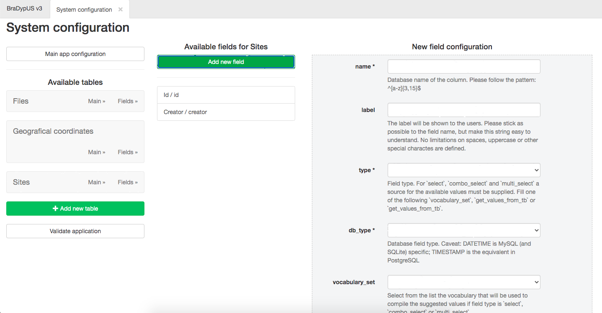
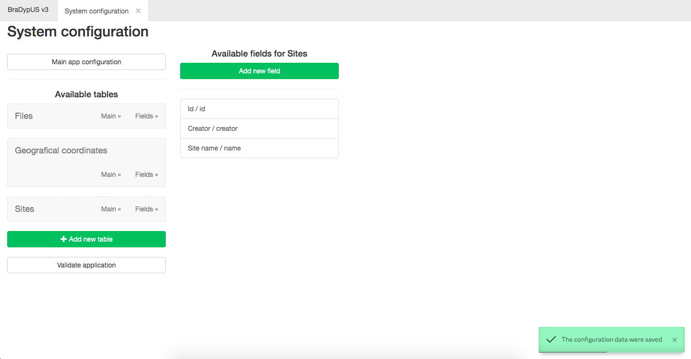

# Adding columns / fields

By adding a table, the two system required columns::
- id (int, PK)
- creator (id)

are automatically added. We still need to enter the remaining:
- name (text, no dupl., id fld)
- typology (text, closed vocabulary)
- chronology (text, closed vocabulary)
- description (text)

In the **System configuration** module, under **Available tables** click on **Fields** of Sites table. In the middle of the screen are listes the avaialable columns.

By clicking on **Add new field** it is possible to add a new column.

 
*New column settings*

---

## The available column settings are

#### name
Database name of the column. Please follow the pattern: ^[a-z]{3,15}$

#### label
The label will be shown to the users. Please stick as possible to the field name, but make this string easy to understand. No limitations on spaces, uppercase or other special charactes are defined.

#### type
Field type. This will be used to render the input to users. For `select`, `combo_select` and `multi_select` a source for the available values must be supplied. Fill one of the following `vocabulary_set`, `get_values_from_tb` or `get_values_from_tb`. One of the following values can be choosen:
- **text**: a one-line free text input (html `input[type="text"]`)
- **date**: a date text imput. Modern browsers will open a calendar to help choosing the date (html5 `input[type="date"]`)
- **long_text**: Multi-line free text input (html `textarea`)
- **select**: a drop-down menu (html `select`)
- **combo_select**: a drop-down menu with the possibility for entering a custom (not available in the list) value
- **multi_select**: a tag style input, whete multipl values from a list can be entered, as well as custom values
- **boolean**: a Yes/No select
- **slider**: a graphical slider to enter numeric values in a range

#### db_type
Database field type. Caveat: DATETIME is MySQL (and SQLite) specific; TIMESTAMP is the equivalent in PostgreSQL. Only a limited list is available, including:
- **TEXT**
- **INTEGER**
- **TIMESTAMP**

#### vocabulary_set
elect from the list the vocabulary that will be used to compile the suggested values if field type is `select`, `combo_select` or `multi_select`. In a fresh instalation the list is empty since no vocabulary has been created yet

#### get_values_from_tb
Insert here the table and field name, whose unique values will be used to compile the suggested values if field type is `select`, `combo_select` or `multi_select`. Syntax: {prefix}__{tablename}:{fieldid}, eg.: sitarc__siti:id_sito

#### id_from_tb
Select here the table, whose unique id values will be used to compile the suggested values if field type is `select`, `combo_select` or `multi_select`. In the database the id will be filed, but users will see the id_field

#### check
Real time (on value change & on form submission) data validation to perform on the enterd field value. One or more values from the following list can be selected and combined:
- **int**: Only numeric values allowed
- **email**: only email patterns allowed (it does not check that email exists)
- **no_dupl**: no duplicate values are allowed. A real-time query in the database will test the entered value
- **not_empty**: field can not be left empty
- **range**: value must be in a predefined range. Use **min** and **max** to define the range. default value 1-10
- **regex**: the entered value must match a [regular expression](https://en.wikipedia.org/wiki/Regular_expression). Use **pattern** to define the regex pattern.

#### active_link
If true the field value will have in read mode a link to a query showing all similar records

#### readonly
If true the field value will be visible, it cannot be edited by users, and its value will be sent to the server

#### disabled
If true the field value will be visible (like `readonly`), it cannot be edited by users (like `readonly`), but its value will not be sen to the server (unlike `readonly`)

#### hide
If true the field value will not be visible to the users (unlike `readonly` and `disabled`), it cannot be edited by users (like `readonly` and `disabled`), and its value will be sent to the server (like `readonly`)

#### def_value
Default value to use on new record insertion. May be changed from te user (if `readonly` or `hide` are nor defined). The following variables can be used: %today%: current date, %current_user%: current user id

#### force_default
If true the default value will overwrite in edit mode the database value. Can be used in comination with `readonly` and `def_value` to save last edited timestamps, of last user id who edited the record

#### max_length
Maximum fields length measured in characters (included white spaces). An integer should be entered.

#### min
Minimum allowed value, for field type `slider` or `check` value *range*. An integer should be entered

#### max
Maximum allowed value, for field type `slider` or `check` value *range*. An integer should be entered

#### pattern
Regex pattern to use for field value validation when `check` is set to regex

#### help
The help text will be shown to the users, explaining them how to compile the field

 
*Filled form with settings for Site name column*

When **Save** is clicked the configuration settings will be saved on file and the 
column will be added to the table in the database. The newly added field will be listed in the Available field list

 
*After saving, the Site name column is added to the Available columns list*

Follow the same procedure to add typology, chronology and description:

- typology:
    - name: typology
    - label: Typology
    - type: select
    - db_type: TEXT
    - vocabulary_set: we will use a vocabulary to control site typologies, but since
    we have not defined a vocabulary yet, we will leave this blank and edit in a second time
- chronology:
    - name: chronology
    - label: Chronology
    - type: multi_select
    - db_type: TEXT
    - vocabulary_set: we will use a vocabulary to control site typologies, but since
    we have not defined a vocabulary yet, we will leave this blank and edit in a second time
- description (text)
    - name: description
    - label: Description
    - type: long_text
    - db_type: TEXT
